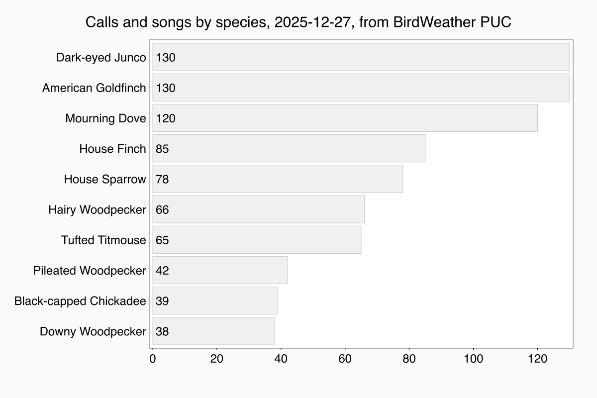
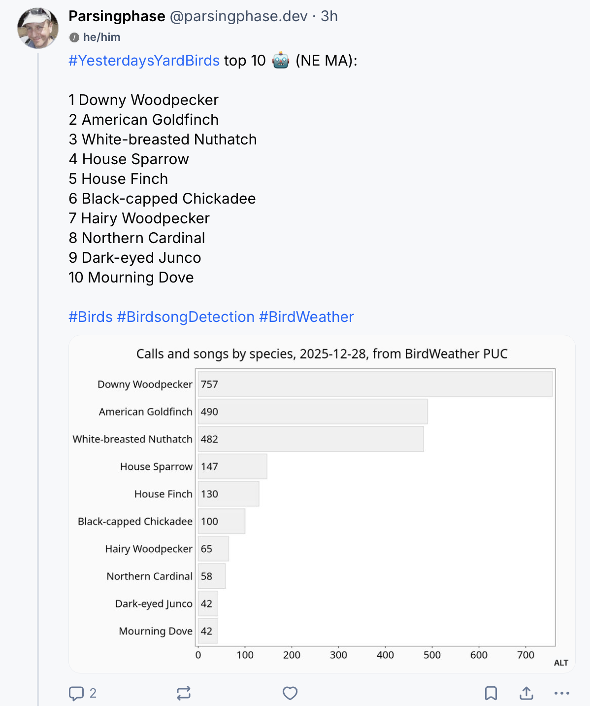
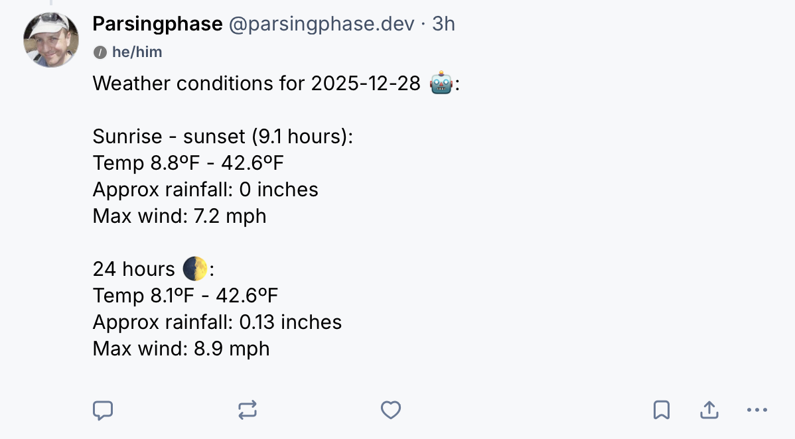

# `atmo-sensor-lambdas`

## fka `masto-bird-summary`

Post daily summaries from Ambient Weather, BirdWeather and Haikubox sensors to social media (Bluesky/ATProto and
Mastodon/Fediverse). Plus a couple of whole-year graphing tools for local use.

Scripts run as AWS Lambdas, CDK IaC is included.

## Examples

### Social Lambdas

### Local usage

#### [drawAllTimeSpeciesChart.ts](utils/drawAllTimeSpeciesChart.ts)

#### [drawSpeciesAnnualHeatmap.ts](utils/drawSpeciesAnnualHeatmap.ts)

## Code quality

"WFM+" - works for me, tidied up a bit. Strongly typed, but no automated testing beyond static & linting.

Some local scripts require modification of fixed values - these are being migrated to use command-line switches. 
The lambdas assume you have exactly the same set of accounts/devices I do, but you can tweak these / comment out sections.

Feel free to email with queries, address is on my [profile page](https://github.com/parsingphase)

## Setup

Copy [config.sample.ts](config/config.sample.ts) to `config/config.ts` and populate.

Run `npm install`

Local-only scripts are in the [utils](utils) directory.

To run the lambdas locally, see `run*Cli.ts`

For test & deploy, see scripts in `package.json`. To deploy to AWS, you'll need Docker and an AWS account.

## Useful links

### Ambient Weather
 
 - Store: https://ambientweather.com
 - Station map: https://ambientweather.net
 - REST API: https://ambientweather.docs.apiary.io

### BirdWeather PUC

 - Store: https://www.birdweather.com
 - Station map: https://app.birdweather.com
 - REST API: https://app.birdweather.com/api/v1
 - GraphQL API: https://app.birdweather.com/api/index.html

### Haikubox

 - Store: https://haikubox.com
 - REST API: https://api.haikubox.com/docs

## Generative "AI" usage

None. Do not submit code created with any generative tooling. 

You are not granted the right to use this code to train any such system.
