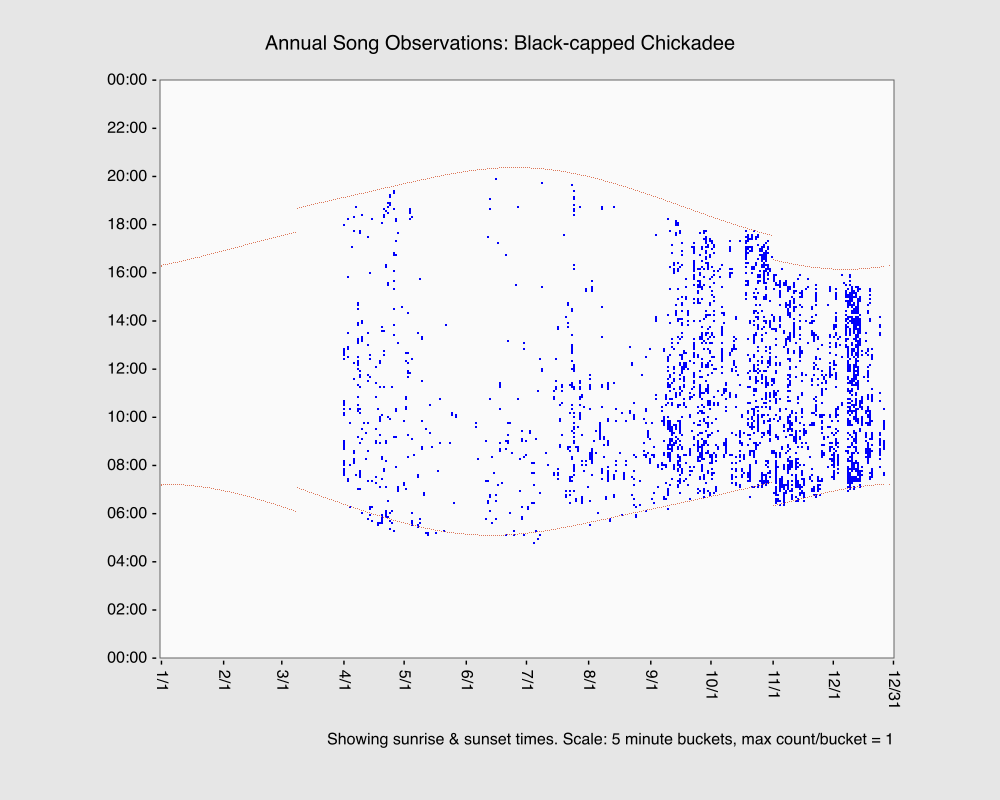

# `atmo-sensor-lambdas`

## fka `masto-bird-summary`

Post daily summaries from Ambient Weather, BirdWeather and Haikubox sensors to social media (Bluesky/ATProto and
Mastodon/Fediverse). Plus a couple of whole-year graphing tools for local use.

Scripts run as AWS Lambdas, CDK IaC is included.

## Examples

### Social Lambdas

### Local usage

#### [drawAllTimeSpeciesChart.ts](utils/drawAllTimeSpeciesChart.ts)

#### [drawSpeciesAnnualHeatmap.ts](utils/drawSpeciesAnnualHeatmap.ts)

## Code quality

"WFM+" - works for me, tidied up a bit. Strongly typed, but no automated testing beyond static & linting.

Some local scripts require modification of fixed values - these are being migrated to use command-line switches.

## Setup

Copy [config.sample.ts](config/config.sample.ts) to `config/config.ts` and populate.

Run `npm install`

For test & deploy, see scripts in `package.json`.

For local testing, see `run*Cli.ts`

## Generative "AI" usage

None. Do not submit code created with any generative tooling. 

You are not granted the right to use this code to train any such system.
